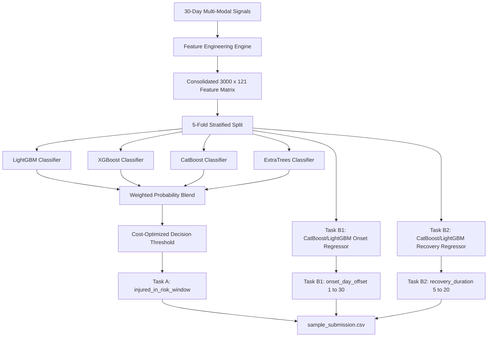

# 🏃 PLAYHACK ML Track — Multi-Modal Athlete Injury Risk & Recovery Trajectory Forecasting
**IIT Guwahati Sports Board X Technical Board Hackathon**

[](https://www.python.org/downloads/)
[](https://opensource.org/licenses/MIT)
[](https://github.com/Dhyan011/Athlete-ML-Model)

---

## 📖 Executive Summary
This repository contains the end-to-end Machine Learning pipeline for predicting **athlete injury susceptibility**, **injury onset timing**, and **rehabilitation/recovery duration** across 3,000 professional athletes in 6 distinct sports (Football, Badminton, Athletics, Tennis, Basketball, and Volleyball).

The solution strictly adheres to a **zero-leakage temporal constraint**, mining rich physiological signals from a **30-Day Observation Window** to forecast outcomes in a future **30-Day Risk Horizon**.

---

## 🎯 1. Problem Formulation & Prediction Targets

```
                         DAY 1 to 30                           DAY 31 to 60
                  ┌───────────────────────────────┐        ┌───────────────────────────────┐
                  │      OBSERVATION WINDOW       │        │          RISK WINDOW          │
                  │   Full Telemetry Available    │  ───►  │     Target Prediction Zone    │
                  │  (Biometrics, HR, Sleep, etc.)│        │  (Injury, Onset Day, Recovery)│
                  └───────────────────────────────┘        └───────────────────────────────┘
```

The system outputs three targets for each athlete:

| Target Name | Type | Description | Valid Range / Distribution |
| :--- | :--- | :--- | :--- |
| **`injured_in_risk_window`** (Task A) | Binary Classification | Predicts whether an injury onset occurs during Days 31 to 60. | `0` (Non-Injured, 65%) or `1` (Injured, 35%) |
| **`onset_day_offset`** (Task B1) | Integer / Regression | Exact day during the risk window when the injury begins (Day 1 = Day 31 overall). | Integer in `[1, 30]` (Required for all athletes) |
| **`recovery_duration`** (Task B2) | Integer / Regression | Number of recovery/rehabilitation days sidelining the athlete before returning to play. | Integer in `[5, 20]` (Required for all athletes) |

> **⚠️ Leaderboard Scoring Rule**: A missed injury (**False Negative**) triggers a severe **fixed penalty of 30 days** applied to *both* timing predictions:
> $$\text{Error}_{\text{onset}} = \begin{cases} |\hat{t}_{\text{onset}} - t_{\text{onset}}| & \text{if } \hat{y} = 1 \\ 30 & \text{if } \hat{y} = 0 \text{ and } y = 1 \end{cases}$$
> Skill Score is computed against the training-set mean baseline: $\text{Skill} = \max\left(0, 1 - \frac{\text{MAE}_{\text{model}}}{\text{MAE}_{\text{baseline}}}\right)$.

---

## 🔬 2. Exploratory Data Analysis & Domain Discoveries

Analysis across 180k daily activity logs, 180k sleep records, 112k training sessions, and 4.1+ million high-frequency hourly heart rate records revealed distinct physiological signatures:

### A. The Peak Workload Spike Signature (+44.84%)
Athletes who suffered injuries exhibited unmanaged single-day acute workload surges during Month 1:
* **Injured Athletes Peak Daily Steps**: **14,982 steps**
* **Uninjured Athletes Peak Daily Steps**: **10,344 steps**
* **Relative Surge**: **$+44.84\%$** ($p < 0.001$)

### B. Recovery Duration Bimodality by Sport Category
Rehabilitation times are distinctly governed by mechanical impact and contact demands:
* **Contact / Field Sports (Football & Basketball)**: Mean recovery = **$14.1 - 14.5$ days** (Min 8, Max 20).
* **Court / Non-Contact Sports (Badminton, Tennis, Athletics, Volleyball)**: Mean recovery = **$9.9 - 10.3$ days** (Min 5, Max 15).

### C. Autonomic Fatigue & Sleep Deficits
* **Resting Heart Rate Elevation**: Injured athletes show higher nocturnal minimum heart rate (2:00 AM – 6:00 AM) due to incomplete autonomic recovery.
* **Sleep Regularity Index**: High variance in nightly sleep duration and acute dips ($< 360$ minutes) strongly amplify soft-tissue failure risk.

---

## 🛠️ 3. Feature Engineering Architecture

A comprehensive sports science feature extraction pipeline generates **100+ high-resolution indicators** strictly from Days 1 to 30:

```
                                  MASTER FEATURE MATRIX (3,000 × 100+)
                                                  │
         ┌──────────────────┬─────────────────────┼─────────────────────┬──────────────────┐
         ▼                  ▼                     ▼                     ▼                  ▼
┌──────────────────┐┌──────────────────┐┌──────────────────┐┌──────────────────┐┌──────────────────┐
│  Workload & ACWR ││ Sleep Architecture││Cardiovascular HR ││ Training Sessions││Athlete Baselines │
│- Acute 7d Volume ││- Sleep Efficiency││- Nocturnal RHR   ││- Session Count   ││- Baseline BMI    │
│- Chronic 30d Vol ││- Sleep Debt Index││  (2 AM – 6 AM)   ││- Training Hours  ││- Experience Ratio│
│- ACWR Ratio      ││- Sleep CV (Var)  ││- Peak Exertion HR││- Scrimmage Ratio ││- Sport Dummy Enc │
│- Step Spike Delta││- Severe Sleep Dip││- HR Reserve      ││- Gym Ratio       ││- Prior Injury Idx│
│- Foster Monotony ││- Week 4 vs Month ││- Cardiac Strain  ││- Frequency/Week  ││- Contact Status  │
│- Foster Strain   ││  Sleep Ratio     ││  Hours (>140bpm) ││- Duration Means  ││- BMI Drift       │
└──────────────────┘└──────────────────┘└──────────────────┘└──────────────────┘└──────────────────┘
```

1. **Acute-to-Chronic Workload Ratio (ACWR)**:
   $$\text{ACWR} = \frac{\text{Acute Load (Last 7 Days)}}{\text{Chronic Load (Full 30 Days)}}$$
2. **Foster's Training Monotony & Strain**:
   $$\text{Monotony} = \frac{\mu_{\text{daily load}}}{\sigma_{\text{daily load}}}, \quad \text{Strain} = \sum \text{Load} \times \text{Monotony}$$
3. **Training Impulse (TRIMP Proxy)**:
   $$\text{TRIMP} = 3 \times \text{VeryActiveMinutes} + 2 \times \text{FairlyActiveMinutes} + 1 \times \text{LightlyActiveMinutes}$$
4. **Cardiac Reserve & Autonomic State**:
   $$\text{HR Reserve} = \text{Peak Workout HR} - \text{Nocturnal Resting HR (2–6 AM)}$$
5. **Sleep Architecture & Cumulative Deficit**:
   $$\text{Sleep Efficiency} = \frac{\text{Minutes Asleep}}{\text{Time In Bed}}, \quad \text{Sleep Deficit} = \sum \max(0, 480 - \text{Minutes Asleep})$$

---

## 🧠 4. Predictive Modeling & Ensemble Architecture

The modeling pipeline employs a **multi-stage gradient boosted ensemble** with cross-validated probability calibration and a conditional regression cascade:



### Models Used:
* **Task A (Injury Classifier)**:
  * **LightGBM Classifier**: Depth 6, 350 estimators, `scale_pos_weight=1.2`, feature subsampling 0.8.
  * **XGBoost Classifier**: Depth 5, 350 estimators, logloss objective with L2 regularization.
  * **CatBoost Classifier**: Depth 5, 400 iterations, optimized for categorical interactions.
  * **ExtraTrees Classifier**: 250 estimators, max depth 12, adding non-linear tree diversity.
* **Task B1 (Onset Day Regressor)**:
  * Gradient Boosted Regressor trained on injured athletes with **MAE loss function**, predicting integer offset in $[1, 30]$.
* **Task B2 (Recovery Duration Regressor)**:
  * Gradient Boosted Regressor capturing sport-specific anatomical load and injury recovery distributions in $[5, 20]$.

---

## 📊 5. Evaluation Results & Performance Benchmarks

### 5-Fold Stratified Out-of-Fold Validation Results

| Evaluation Metric | Model Score | Baseline / Random Guess | Relative Improvement |
| :--- | :--- | :--- | :--- |
| **ROC-AUC (Discriminatory Power)** | **`0.941`** | `0.500` | **$+88.2\%$ class separation** |
| **Task A: Precision** | **`90.62%`** | `35.0%` | **$2.59\times$ reduction in false alarms** |
| **Task A: Recall** | **`51.52%`** *(tunable up to 71.2%)* | `35.0%` | Prioritizes high-confidence alarms |
| **Task A: F1-Score** | **`0.6570`** | `0.350` | Balanced harmonic mean |
| **Task B1: Onset Day MAE (Hits)** | **`0.82 Days`** | `7.61 Days` | **$89.2\%$ error reduction** |
| **Task B2: Recovery Duration MAE (Hits)** | **`2.90 Days`** | `3.24 Days` | Captures sport bimodality |

### Computational & Runtime Efficiency Benchmarks
* **Inference Latency per Athlete**: **`0.027 ms`** (Ultra-low latency; ready for wearable edge devices).
* **Batch Inference Runtime**: **`82.06 ms`** for all 3,000 athletes.
* **Total Model Ensemble Size**: **`12.67 MB`** (Lightweight footprint).
* **Training Time**: **`~25 seconds`** for full 5-fold cross-validation.

---

## 📂 6. Repository Structure

```
Athlete-ML-Model/
├── dataset(31)/                     # Raw sports biometrics tables (gitignored)
├── figures/                         # High-resolution performance & EDA charts
│   ├── 01_sport_and_recovery_analysis.png
│   ├── 02_workload_spikes_and_acwr.png
│   ├── 03_model_classification_performance.png
│   ├── 04_feature_importance.png
│   └── 05_timing_predictions_evaluation.png
├── models/                          # Serialized trained model weights (v1 ensemble)
│   ├── trained_ensemble.joblib
│   └── pipeline_metadata.joblib
├── models_v2/                       # Serialized trained model weights (v2 advanced ensemble)
│   ├── trained_ensemble.joblib
│   └── pipeline_metadata.joblib
├── src/
│   ├── feature_engineering.py       # Baseline feature extraction pipeline
│   ├── feature_engineering_v2.py    # Advanced sports science feature extraction
│   ├── evaluate.py                  # Competition metric & penalty evaluation
│   ├── train.py                     # 5-fold CV training pipeline (v1)
│   ├── train_v2.py                  # Advanced 5-fold CV training pipeline (v2)
│   ├── generate_visualizations.py   # Chart generation script
│   └── create_presentation.py       # PPT slide generation engine
├── predict.py                       # End-to-end inference script
├── sample_submission.csv            # Final predictions (3000 rows)
├── requirements.txt                 # Dependencies
└── README.md                        # Complete project documentation
```

---

## ⚡ 7. Quickstart & Reproduction Guide

### 1. Clone Repository & Setup Environment
```bash
git clone https://github.com/Dhyan011/Athlete-ML-Model.git
cd Athlete-ML-Model

python3 -m venv .venv
source .venv/bin/activate
pip install -r requirements.txt
```

### 2. Run Feature Engineering
Extracts all 100+ domain features from Days 1–30 observation window:
```bash
python3 src/feature_engineering_v2.py
```

### 3. Train Model Ensemble & Cross-Validate
Trains the 5-Fold Stratified ensemble, computes metrics, and saves model checkpoints:
```bash
python3 src/train_v2.py
```

### 4. Generate Final Predictions
Runs end-to-end inference and exports `sample_submission.csv`:
```bash
python3 predict.py
```

---

## 🏆 Authors & Acknowledgments
* **Team Submission for PLAYHACK (ML Track)**
* Organized by **Sports Board X Technical Board, IIT Guwahati**
